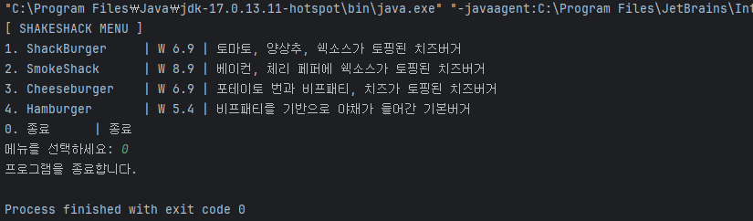
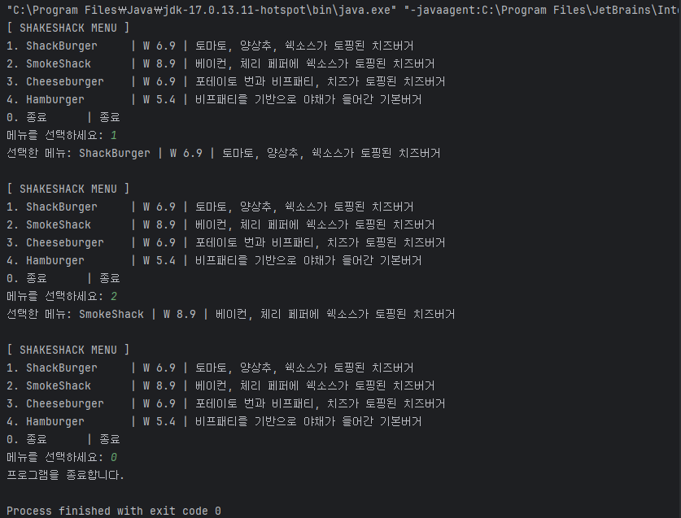
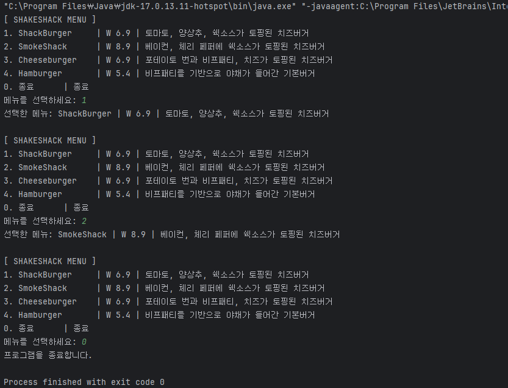
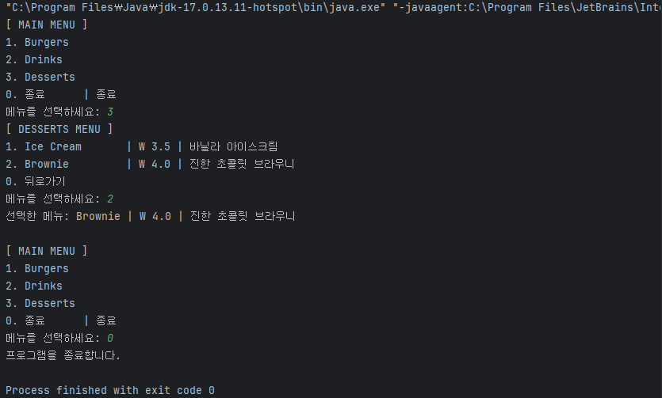

# LV1~LV5 CH 2 키오스크 과제 김학산

### Lv 1. 기본적인 키오스크를 프로그래밍해보자
요구사항이 가지는 의도
입력 처리와 간단한 흐름 제어를 복습합니다. (프로그래밍 검증)
Scanner 활용법, 조건문, 반복문을 재확인하며 입력 데이터를 처리하는 방법 강화
햄버거 메뉴 출력 및 선택하기
Scanner를 사용하여 여러 햄버거 메뉴를 출력합니다.
제시된 메뉴 중 입력받은 숫자에 따라 다른 로직을 실행하는 코드를 작성합니다.
반복문을 이용해서 특정 번호가 입력되면 프로그램을 종료합니다.
Lv1을 구현하면 터미널에 이렇게 보여집니다.
```
[ SHAKESHACK MENU ]
1. ShackBurger   | W 6.9 | 토마토, 양상추, 쉑소스가 토핑된 치즈버거
2. SmokeShack    | W 8.9 | 베이컨, 체리 페퍼에 쉑소스가 토핑된 치즈버거
3. Cheeseburger  | W 6.9 | 포테이토 번과 비프패티, 치즈가 토핑된 치즈버거
4. Hamburger     | W 5.4 | 비프패티를 기반으로 야채가 들어간 기본버거
0. 종료      | 종료
   0 <- // 0을 입력

프로그램을 종료합니다.
```

### Lv 2. 객체 지향 설계를 적용해 햄버거 메뉴를 클래스로 관리하기

- [ ]  **요구사항이 가지는 의도**
  - [ ]  객체 지향 개념을 학습하고, 데이터를 구조적으로 관리하며 프로그램을 설계하는 방법을 익힙니다.
  - [ ]  햄버거 메뉴를 `MenuItem` 클래스와 `List`를 통해 관리합니다.

---

- [ ]  **`MenuItem` 클래스 생성하기**
  - [ ]  설명 : 개별 음식 항목을 관리하는 클래스입니다. 현재는 햄버거만 관리합니다.
  - [ ]  클래스는 `이름`, `가격`, `설명` 필드를 갖습니다.
- [ ]  `main` 함수에서 `MenuItem` 클래스를 활용하여 햄버거 메뉴를 출력합니다.
  - [ ]  `MenuItem` 객체 생성을 통해 `이름`, `가격`, `설명`을 세팅합니다.
    - [ ]  키워드: `new`
  - [ ]  `List`를 선언하여 여러 `MenuItem`을 추가합니다.
    - [ ]  `List<MenuItem> menuItems = new ArrayList<>();`
  - [ ]  반복문을 활용해 `menuItems`를 탐색하면서 하나씩 접근합니다.

``` 구조예시
  // 구조예시
  public static void main(String[] args) {
  // List 선언 및 초기화
  // add 함수를 통해 new MenuItem(이름, 가격, 설명) List에 삽입

  	// Scanner 선언
  	
  	// 반복문을 활용해 List 안에 있는 MenuItem을 하나씩 출력
  	// 숫자를 입력 받기
  	// 입력된 숫자에 따른 처리
  		// 프로그램을 종료
  		// 선택한 메뉴 : 이름, 가격, 설명
}
```

### Lv 3. 객체 지향 설계를 적용해 순서 제어를 클래스로 관리하기

- [ ]  **요구사항이 가지는 의도**
  - [ ]  객체 지향 개념을 학습하고, 데이터를 구조적으로 관리하며 프로그램을 설계하는 방법을 익힙니다.
  - [ ]  `main` 함수에서 관리하던 전체 순서 제어를 `Kiosk` 클래스를 통해 관리합니다.
- [ ]  **`Kiosk` 클래스 생성하기**
  - [ ]  **설명**: 키오스크 프로그램의 메뉴를 관리하고 사용자 입력을 처리하는 클래스입니다.
  - [ ]  `MenuItem`을 관리하는 리스트가 필드로 존재합니다.
  - [ ]  `main` 함수에서 관리하던 입력과 반복문 로직은 이제 `start` 함수를 만들어 관리합니다.
  - [ ]  `List<MenuItem> menuItems` 는 `Kiosk` 클래스 생성자를 통해 값을 할당합니다.
    - [ ]  `Kiosk` 객체를 생성하고 사용하는 `main` 함수에서 객체를 생성할 때 값을 넘겨줍니다.
- [ ]  요구사항에 부합하는지 검토
  - [ ]  키오스크 프로그램을 시작하는 메서드가 구현되어야 합니다.
    - [ ]  콘솔에 햄버거 메뉴를 출력합니다.
    - [ ]  사용자의 입력을 받아 메뉴를 선택하거나 프로그램을 종료합니다.
    - [ ]  유효하지 않은 입력에 대해 오류 메시지를 출력합니다.
    - [ ]  `0`을 입력하면 프로그램이 ‘뒤로가기’되거나 ‘종료’됩니다.

Lv 4. 객체 지향 설계를 적용해 음식 메뉴와 주문 내역을 클래스 기반으로 관리하기
Menu 클래스 생성하기
설명 : MenuItem 클래스를 관리하는 클래스입니다.
예를 들어, 버거 메뉴, 음료 메뉴 등 각 카테고리 내에 여러 MenuItem을 포함합니다.
List<MenuItem> 은 Kiosk 클래스가 관리하기에 적절하지 않으므로 Menu 클래스가 관리하도록 변경합니다.
여러 버거들을 포함하는 상위 개념 ‘버거’ 같은 카테고리 이름 필드를 갖습니다.
메뉴 카테고리 이름을 반환하는 메서드가 구현되어야 합니다.
```
구조 예시
public static void main(String[] args) {
// Menu 객체 생성하면서 카테고리 이름 설정
// Menu 클래스 내 있는 List<MenuItem> 에 MenuItem 객체 생성하면서 삽입

		// Kiosk 객체 생성
		// Kiosk 내 시작하는 함수 호출
}

public class Kiosk {

		start() {
			// 스캐너 선언
			// 반복문 시작
			
			// List와 Menu 클래스 활용하여 상위 카테고리 메뉴 출력
			
			// 숫자 입력 받기
			
			// 입력 받은 숫자가 올바르다면 인덱스로 활용하여 List에 접근하기
				// List<Menu>에 인덱스로 접근하면 Menu만 추출할 수 있겠죠?
			
			// Menu가 가진 List<MenuItem>을 반복문을 활용하여 햄버거 메뉴 출력
			
			// 숫자 입력 받기
			// 입력 받은 숫자가 올바르다면 인덱스로 활용해서 Menu가 가지고 있는 List<MenuItem>에 접근하기
				// menu.getMenuItems().get(i); 같은 형식으로 하나씩 들어가서 얻어와야 합니다.
		}

}

public class Menu {
// MenuItem 클래스를 List로 관리

		// List에 들어있는 MenuItem을 순차적으로 보여주는 함수
		// List를 리턴하는 함수
		
		// 구조에 맞게 함수를 선언해놓고 가져다 사용하세요.
}

public class MenuItem {
// 이름, 가격, 설명 필드 선언하여 관리

		// 구조에 맞게 함수를 선언해놓고 가져다 사용하세요.
}
```
```
​
Lv4를 구현하면 터미널에 이렇게 보여집니다.
[ MAIN MENU ]
1. Burgers
2. Drinks
3. Desserts
0. 종료      | 종료
   1 <- // 1을 입력

[ BURGERS MENU ]
1. ShackBurger   | W 6.9 | 토마토, 양상추, 쉑소스가 토핑된 치즈버거
2. SmokeShack    | W 8.9 | 베이컨, 체리 페퍼에 쉑소스가 토핑된 치즈버거
3. Cheeseburger  | W 6.9 | 포테이토 번과 비프패티, 치즈가 토핑된 치즈버거
4. Hamburger     | W 5.4 | 비프패티를 기반으로 야채가 들어간 기본버거
0. 뒤로가기
   2 <- // 2를 입력
   선택한 메뉴: SmokeShack | W 8.9 | 베이컨, 체리 페퍼에 쉑소스가 토핑된 치즈버거

[ MAIN MENU ]
1. Burgers
2. Drinks
3. Desserts
0. 종료      | 종료
   0 <- // 0을 입력
   프로그램을 종료합니다.
   ​
 ```

 ###  Lv 5. 캡슐화 적용하기
   MenuItem, Menu 그리고 Kiosk 클래스의 필드에 직접 접근하지 못하도록 설정합니다.
   Getter와 Setter 메서드를 사용해 데이터를 관리합니다.


### Main.java
```js
package com.example.calculator;
import java.util.Scanner;

public class Main {
    public static void main(String[] args) {
    Scanner sc = new Scanner(System.in);

    System.out.println("계산기를 실행합니다!!!");

    double a = 0, b = 0;
    try {
    System.out.print("첫 번째 숫자를 입력하세요: ");
    a = sc.nextDouble();

    System.out.print("두 번째 숫자를 입력하세요: ");
    b = sc.nextDouble();
} catch (Exception e) {
    System.out.println("오류: 숫자를 입력해야 합니다.");
    return;
}

System.out.print("사칙연산 기호를 입력하세요(+, -, x, /) : ");
String c = sc.next();
double result = 0;

if (c.equals("+")) {
    result = a + b;
} else if (c.equals("-")) {
    result = a - b;
} else if (c.equals("x")) {
    result = a * b;
} else if (c.equals("/")) {
    if (b == 0) {
        System.out.println("나눗셈 연산에서 분모(두번째 정수)에 0이 입력될 수 없습니다.");
        return;
    }
    result = a / b;
} else {
    System.out.println("잘못된 사칙연산 기호를 입력하였습니다.");
    return;
}
System.out.println("결과: " + result);

while(true) {
    System.out.print("숫자를 입력하세요 (또는 'exit'를 입력하여 종료): ");
    String input = sc.next();

    if (input.equals("exit")) {
        System.out.println("계산기를 종료합니다.");
        break;
    }

    double d;
    try {
        d = Double.parseDouble(input); //String을 double로 변환
    } catch (Exception e) {
        System.out.println("유효한 숫자를 입력해야 합니다.");
        continue;
    }

    System.out.print("사칙연산 기호를 입력하세요(+, -, x, /) : ");
    String e = sc.next();
    double result2 = 0;

    if (e.equals("+")) {
        result2 = result + d;
    } else if (e.equals("-")) {
        result2 = result - d;
    } else if (e.equals("x")) {
        result2 = result * d;
    } else if (e.equals("/")) {
        if (d == 0) {
            System.out.println("나눗셈 연산에서 분모(두번째 정수)에 0이 입력될 수 없습니다.");
            continue;
        }
        result2 = result / d;
    } else {
        System.out.println("잘못된 사칙연산 기호를 입력하였습니다.");
        continue;
    }

    System.out.println("결과: " + result2);
    result = result2;
        }
    }
}
```

## LV1. 소스코드
Kiosk.java
```
package Kiosk1;

import java.util.Scanner;

public class Kiosk {
    public static void main(String[] args) {
        /**
         * 메뉴 아이템 데이터를 2차원 배열로 선언
         * 각 배열의 요소는 {메뉴 이름, 가격, 설명} 순서로 저장됩니다.
         */
        String[][] menuItems = {
                {"ShackBurger", "6.9", "토마토, 양상추, 쉑소스가 토핑된 치즈버거"},
                {"SmokeShack", "8.9", "베이컨, 체리 페퍼에 쉑소스가 토핑된 치즈버거"},
                {"Cheeseburger", "6.9", "포테이토 번과 비프패티, 치즈가 토핑된 치즈버거"},
                {"Hamburger", "5.4", "비프패티를 기반으로 야채가 들어간 기본버거"}
        };

        /**
         * Scanner 객체를 생성하여 사용자 입력을 처리합니다.
         */
        Scanner in = new Scanner(System.in);

        /**
         * 프로그램은 사용자가 종료 명령(0)을 입력할 때까지 반복됩니다.
         */
        while (true) {
            /**
             * 메뉴 출력
             * 메뉴는 1번부터 시작하며, 각 메뉴 항목은 이름, 가격, 설명으로 구성됩니다.
             * 종료 옵션은 항상 0번으로 출력됩니다.
             */
            System.out.println("[ SHAKESHACK MENU ]");
            for (int i = 0; i < menuItems.length; i++) {
                System.out.printf("%d. %-15s | W %.1f | %s\n", i + 1, menuItems[i][0], Double.parseDouble(menuItems[i][1]), menuItems[i][2]);
            }
            System.out.println("0. 종료      | 종료");

            /**
             * 사용자 입력 요청 및 입력 값 받기
             * 입력 값은 문자열로 받고, 이후 처리에서 숫자로 변환합니다.
             */
            System.out.print("메뉴를 선택하세요: ");
            String input = in.nextLine();

            /**
             * 종료 조건: 사용자가 "0"을 입력하면 반복문을 탈출하고 프로그램을 종료합니다.
             */
            if (input.equals("0")) {
                System.out.println("프로그램을 종료합니다.");
                break;
            }

            /**
             * 입력된 값이 유효한 메뉴 번호인지 확인합니다.
             * 유효한 입력(1~menuItems.length)에 따라 메뉴 정보를 출력합니다.
             * 숫자 변환이 실패하거나 유효하지 않은 값일 경우, 적절한 오류 메시지를 출력합니다.
             */
            try {
                int choice = Integer.parseInt(input); // 입력 값을 숫자로 변환
                if (choice > 0 && choice <= menuItems.length) {
                    // 유효한 메뉴 선택
                    String name = menuItems[choice - 1][0];
                    double price = Double.parseDouble(menuItems[choice - 1][1]);
                    String description = menuItems[choice - 1][2];
                    System.out.printf("선택한 메뉴: %s | W %.1f | %s\n\n", name, price, description);
                } else {
                    // 유효하지 않은 메뉴 번호 처리
                    System.out.println("유효하지 않은 메뉴 번호입니다. 다시 선택해주세요.\n");
                }
            } catch (NumberFormatException e) {
                // 숫자가 아닌 값 입력 시 처리
                System.out.println("잘못된 입력입니다. 숫자를 입력해주세요.\n");
            }
        }

        /**
         * Scanner 객체를 닫아 리소스를 해제합니다.
         */
        in.close();
    }
}
```
## LV1. 출력결과

## LV2. 소스코드
Main.java
```
package Kiosk2;

import java.util.ArrayList;
import java.util.List;
import java.util.Scanner;

public class Main {

    /**
     * 프로그램의 진입점 (Entry Point)입니다.
     * 햄버거 메뉴를 관리하고 사용자 입력을 처리합니다.
     */
    public static void main(String[] args) {
        // List 선언 및 초기화
        /**
         * 햄버거 메뉴 데이터를 저장할 List 객체 생성.
         * 각 항목은 MenuItem 객체로 구성됩니다.
         */
        List<MenuItem> menuItems = new ArrayList<>();

        // add 함수를 통해 MenuItem 객체를 List에 삽입
        /**
         * 메뉴 데이터를 MenuItem 객체로 생성하여 리스트에 추가.
         * 메뉴 이름, 가격, 설명 정보를 포함합니다.
         */
        menuItems.add(new MenuItem("ShackBurger", 6.9, "토마토, 양상추, 쉑소스가 토핑된 치즈버거"));
        menuItems.add(new MenuItem("SmokeShack", 8.9, "베이컨, 체리 페퍼에 쉑소스가 토핑된 치즈버거"));
        menuItems.add(new MenuItem("Cheeseburger", 6.9, "포테이토 번과 비프패티, 치즈가 토핑된 치즈버거"));
        menuItems.add(new MenuItem("Hamburger", 5.4, "비프패티를 기반으로 야채가 들어간 기본버거"));

        // Scanner 선언
        /**
         * 사용자 입력을 처리하기 위한 Scanner 객체 생성.
         */
        Scanner scanner = new Scanner(System.in);

        while (true) {
            // 반복문을 활용해 List 안에 있는 MenuItem을 하나씩 출력
            /**
             * 메뉴 리스트를 화면에 출력.
             * 각 메뉴 항목에 대해 번호, 이름, 가격, 설명을 표시합니다.
             */
            System.out.println("[ SHAKESHACK MENU ]");
            for (int i = 0; i < menuItems.size(); i++) {
                MenuItem item = menuItems.get(i);
                System.out.printf("%d. %-15s | W %.1f | %s\n", i + 1, item.getName(), item.getPrice(), item.getPriceInfo());
            }
            System.out.println("0. 종료      | 종료");

            // 숫자를 입력받기
            /**
             * 사용자로부터 메뉴 선택 번호를 입력받습니다.
             * 입력값은 문자열로 처리한 뒤 정수로 변환합니다.
             */
            System.out.print("메뉴를 선택하세요: ");
            String input = scanner.nextLine();

            // 입력된 숫자에 따른 처리
            try {
                int choice = Integer.parseInt(input); // 문자열을 정수로 변환

                if (choice == 0) { // 프로그램 종료 조건
                    /**
                     * 사용자가 0을 입력한 경우 프로그램 종료 메시지를 출력하고 루프를 종료합니다.
                     */
                    System.out.println("프로그램을 종료합니다.");
                    break;
                } else if (choice > 0 && choice <= menuItems.size()) {
                    /**
                     * 유효한 메뉴 번호를 입력받은 경우:
                     * 선택한 메뉴의 이름, 가격, 설명을 출력합니다.
                     */
                    MenuItem selectedItem = menuItems.get(choice - 1);
                    System.out.printf("선택한 메뉴: %s | W %.1f | %s\n\n", selectedItem.getName(), selectedItem.getPrice(), selectedItem.getPriceInfo());
                } else {
                    /**
                     * 입력값이 유효하지 않은 메뉴 번호일 경우:
                     * 사용자에게 유효하지 않은 번호임을 알립니다.
                     */
                    System.out.println("유효하지 않은 메뉴 번호입니다. 다시 입력해주세요.\n");
                }
            } catch (NumberFormatException e) {
                /**
                 * 입력값이 정수가 아닌 경우:
                 * 사용자에게 숫자를 입력하도록 요청합니다.
                 */
                System.out.println("잘못된 입력입니다. 숫자를 입력해주세요.\n");
            }
        }

        // Scanner 닫기
        /**
         * 프로그램 종료 전 Scanner 객체를 닫아 자원을 해제합니다.
         */
        scanner.close();
    }
}
```
MenuItem.java
```
package Kiosk2;

/**
 * 개별 메뉴 항목을 관리하는 클래스입니다.
 * 각 메뉴는 이름, 가격, 설명 데이터를 포함합니다.
 */
public class MenuItem {
    private String name; // 메뉴 이름
    private double price; // 메뉴 가격
    private String priceInfo; // 메뉴 설명

    /**
     * 생성자
     * @param name      메뉴 이름
     * @param price     메뉴 가격
     * @param priceInfo 메뉴 설명
     */
    public MenuItem(String name, double price, String priceInfo) {
        this.name = name;
        this.price = price;
        this.priceInfo = priceInfo;
    }

    /**
     * 메뉴 이름을 반환합니다.
     * @return 메뉴 이름
     */
    public String getName() {
        return name;
    }

    /**
     * 메뉴 가격을 반환합니다.
     * @return 메뉴 가격
     */
    public double getPrice() {
        return price;
    }

    /**
     * 메뉴 설명을 반환합니다.
     * @return 메뉴 설명
     */
    public String getPriceInfo() {
        return priceInfo;
    }
}
```
## LV2. 출력결과

## LV3. 소스코드
Kiosk.java
```
package Kiosk3;

import java.util.ArrayList;
import java.util.List;
import java.util.Scanner;

/**
 * Kiosk 클래스는 키오스크 프로그램의 흐름을 제어하는 역할을 합니다.
 * - 메뉴 항목을 관리하는 리스트를 필드로 가집니다.
 * - 사용자 입력을 받아 메뉴를 선택하거나 프로그램을 종료합니다.
 * - 입력 및 예외 처리를 통해 유효하지 않은 입력에 대한 메시지를 출력합니다.
 */
public class Kiosk {
    private List<MenuItem> menuItems; // 메뉴 항목을 관리하는 리스트

    /**
     * 생성자: Kiosk 객체를 생성하며 메뉴 항목 리스트를 초기화합니다.
     * @param menuItems 초기화할 메뉴 항목 리스트
     */
    public Kiosk(List<MenuItem> menuItems) {
        this.menuItems = menuItems;
    }

    /**
     * start 메서드는 키오스크 프로그램의 메인 로직을 실행합니다.
     * - 메뉴를 출력하고 사용자 입력을 처리합니다.
     * - 0을 입력하면 프로그램을 종료합니다.
     */
    public void start() {
        Scanner scanner = new Scanner(System.in);

        while (true) {
            // 메뉴 출력
            System.out.println("[ SHAKESHACK MENU ]");
            for (int i = 0; i < menuItems.size(); i++) {
                MenuItem item = menuItems.get(i);
                System.out.printf("%d. %-15s | W %.1f | %s\n", i + 1, item.getName(), item.getPrice(), item.getPriceInfo());
            }
            System.out.println("0. 종료      | 종료");

            // 사용자 입력 처리
            System.out.print("메뉴를 선택하세요: ");
            String input = scanner.nextLine();

            // 종료 조건
            if (input.equals("0")) {
                System.out.println("프로그램을 종료합니다.");
                break;
            }

            // 메뉴 선택 처리
            try {
                int choice = Integer.parseInt(input); // 입력 값을 정수로 변환
                if (choice > 0 && choice <= menuItems.size()) {
                    // 선택한 메뉴 출력
                    MenuItem selectedItem = menuItems.get(choice - 1);
                    System.out.printf("선택한 메뉴: %s | W %.1f | %s\n\n", selectedItem.getName(), selectedItem.getPrice(), selectedItem.getPriceInfo());
                } else {
                    // 메뉴 번호가 범위를 벗어난 경우
                    System.out.println("유효하지 않은 메뉴 번호입니다. 다시 입력해주세요.\n");
                }
            } catch (NumberFormatException e) {
                // 입력값이 숫자가 아닌 경우
                System.out.println("잘못된 입력입니다. 숫자를 입력해주세요.\n");
            }
        }

        scanner.close(); // Scanner 자원 해제
    }
}
```
Main.java
```
package Kiosk3;

import java.util.ArrayList;
import java.util.List;

/**
 * Main 클래스는 키오스크 프로그램을 실행하는 진입점입니다.
 * - 메뉴 항목을 생성하고 Kiosk 객체를 실행합니다.
 */
public class Main {
    public static void main(String[] args) {
        // 메뉴 항목 생성 및 초기화
        List<MenuItem> menuItems = new ArrayList<>();
        menuItems.add(new MenuItem("ShackBurger", 6.9, "토마토, 양상추, 쉑소스가 토핑된 치즈버거"));
        menuItems.add(new MenuItem("SmokeShack", 8.9, "베이컨, 체리 페퍼에 쉑소스가 토핑된 치즈버거"));
        menuItems.add(new MenuItem("Cheeseburger", 6.9, "포테이토 번과 비프패티, 치즈가 토핑된 치즈버거"));
        menuItems.add(new MenuItem("Hamburger", 5.4, "비프패티를 기반으로 야채가 들어간 기본버거"));

        // Kiosk 객체 생성 및 실행
        Kiosk kiosk = new Kiosk(menuItems);
        kiosk.start(); // 키오스크 프로그램 시작
    }
}
```
MenuItem.java
```
package Kiosk3;

/**
 * MenuItem 클래스는 개별 메뉴 항목을 관리합니다.
 * - 각 메뉴 항목은 이름, 가격, 설명 필드를 가집니다.
 * - 해당 필드의 값을 반환하는 Getter 메서드를 제공합니다.
 */
public class MenuItem {
    private String name; // 메뉴 이름
    private double price; // 메뉴 가격
    private String priceInfo; // 메뉴 설명

    /**
     * 생성자: MenuItem 객체를 생성하며 필드를 초기화합니다.
     * @param name 메뉴 이름
     * @param price 메뉴 가격
     * @param priceInfo 메뉴 설명
     */
    public MenuItem(String name, double price, String priceInfo) {
        this.name = name;
        this.price = price;
        this.priceInfo = priceInfo;
    }

    /**
     * Getter 메서드: 메뉴 이름을 반환합니다.
     * @return 메뉴 이름
     */
    public String getName() {
        return name;
    }

    /**
     * Getter 메서드: 메뉴 가격을 반환합니다.
     * @return 메뉴 가격
     */
    public double getPrice() {
        return price;
    }

    /**
     * Getter 메서드: 메뉴 설명을 반환합니다.
     * @return 메뉴 설명
     */
    public String getPriceInfo() {
        return priceInfo;
    }
}
```

## LV3. 출력결과

## LV4. 소스코드
Kiosk.java
```
package Kiosk4;

import java.util.List;
import java.util.Scanner;

public class Kiosk {
    private List<Menu> menus; // 전체 메뉴 카테고리를 관리하는 리스트

    /**
     * Kiosk 객체 생성 시 전체 메뉴를 전달받아 초기화하는 생성자
     * @param menus 전체 메뉴 리스트
     */
    public Kiosk(List<Menu> menus) {
        this.menus = menus;
    }

    /**
     * Kiosk 프로그램을 시작하는 메서드
     * - 사용자가 메뉴를 선택하고 카테고리별 메뉴를 출력
     * - 잘못된 입력 처리 및 종료 조건 구현
     */
    public void start() {
        Scanner scanner = new Scanner(System.in); // 사용자 입력을 받기 위한 Scanner 객체 생성

        while (true) {
            /**
             * 메인 메뉴 출력
             * - 카테고리별 메뉴를 나열하고, 종료 옵션을 제공
             */
            System.out.println("[ MAIN MENU ]");
            for (int i = 0; i < menus.size(); i++) {
                // 각 메뉴 카테고리 이름 출력
                System.out.printf("%d. %s\n", i + 1, menus.get(i).getCategoryName());
            }
            System.out.println("0. 종료      | 종료");

            // 사용자 입력 받기
            System.out.print("메뉴를 선택하세요: ");
            String input = scanner.nextLine();

            /**
             * 종료 조건: "0"을 입력하면 프로그램 종료
             */
            if (input.equals("0")) {
                System.out.println("프로그램을 종료합니다.");
                break;
            }

            /**
             * 입력 처리: 숫자 입력이 유효한지 확인
             * - 숫자가 아닌 입력은 예외 처리
             */
            try {
                int choice = Integer.parseInt(input); // 입력받은 값을 정수로 변환
                if (choice > 0 && choice <= menus.size()) {
                    // 선택된 메뉴 카테고리를 가져와서 해당 메뉴 항목을 처리
                    Menu selectedMenu = menus.get(choice - 1);
                    handleMenuSelection(scanner, selectedMenu);
                } else {
                    System.out.println("유효하지 않은 선택입니다. 다시 입력해주세요.\n");
                }
            } catch (NumberFormatException e) {
                // 숫자가 아닌 입력을 받았을 경우 처리
                System.out.println("잘못된 입력입니다. 숫자를 입력해주세요.\n");
            }
        }

        scanner.close();
    }

    /**
     * 카테고리별 메뉴 선택을 처리하는 메서드
     * @param scanner 사용자 입력을 받기 위한 Scanner 객체
     * @param selectedMenu 사용자가 선택한 카테고리 메뉴
     */
    private void handleMenuSelection(Scanner scanner, Menu selectedMenu) {
        while (true) {
            /**
             * 선택된 카테고리 메뉴 출력
             * - 해당 카테고리의 메뉴 항목들을 나열
             */
            selectedMenu.displayMenuItems();

            // 사용자 입력 받기
            System.out.print("메뉴를 선택하세요: ");
            String input = scanner.nextLine();

            /**
             * 뒤로가기 조건: "0"을 입력하면 메인 메뉴로 돌아감
             */
            if (input.equals("0")) {
                System.out.println("메인 메뉴로 돌아갑니다.\n");
                break;
            }

            /**
             * 입력 처리: 메뉴 항목을 선택하면 해당 항목의 정보를 출력
             * - 잘못된 입력 처리
             */
            try {
                int choice = Integer.parseInt(input); // 입력받은 값을 정수로 변환
                List<MenuItem> items = selectedMenu.getMenuItems();
                if (choice > 0 && choice <= items.size()) {
                    // 선택된 메뉴 항목 정보 출력
                    MenuItem selectedItem = items.get(choice - 1);
                    System.out.printf("선택한 메뉴: %s | W %.1f | %s\n\n",
                            selectedItem.getName(), selectedItem.getPrice(), selectedItem.getPriceInfo());

                    /**
                     * 선택 후 MAIN MENU로 이동
                     * - 메뉴 항목을 출력한 후 MAIN MENU로 돌아가기 위해 메서드 종료
                     */
                    return;
                } else {
                    System.out.println("유효하지 않은 선택입니다. 다시 입력해주세요.\n");
                }
            } catch (NumberFormatException e) {
                // 숫자가 아닌 입력을 받았을 경우 처리
                System.out.println("잘못된 입력입니다. 숫자를 입력해주세요.\n");
            }
        }
    }
}
```
Main.java
```
package Kiosk4;

import java.util.ArrayList;
import java.util.List;

public class Main {
    public static void main(String[] args) {
        /**
         * 메뉴 항목을 설정하여 카테고리별로 관리하기 위한 Menu 객체 생성
         * - 각 메뉴를 카테고리별로 초기화하고 메뉴 항목을 추가
         */

        // Burgers 메뉴 초기화
        Menu burgers = new Menu("Burgers");
        burgers.addMenuItem(new MenuItem("ShackBurger", 6.9, "토마토, 양상추, 쉑소스가 토핑된 치즈버거"));
        burgers.addMenuItem(new MenuItem("SmokeShack", 8.9, "베이컨, 체리 페퍼에 쉑소스가 토핑된 치즈버거"));
        burgers.addMenuItem(new MenuItem("Cheeseburger", 6.9, "포테이토 번과 비프패티, 치즈가 토핑된 치즈버거"));
        burgers.addMenuItem(new MenuItem("Hamburger", 5.4, "비프패티를 기반으로 야채가 들어간 기본버거"));

        // Drinks 메뉴 초기화
        Menu drinks = new Menu("Drinks");
        drinks.addMenuItem(new MenuItem("Coke", 2.0, "시원한 코카콜라"));
        drinks.addMenuItem(new MenuItem("Sprite", 2.0, "상쾌한 스프라이트"));
        drinks.addMenuItem(new MenuItem("Water", 1.5, "깨끗한 생수"));

        // Desserts 메뉴 초기화
        Menu desserts = new Menu("Desserts");
        desserts.addMenuItem(new MenuItem("Ice Cream", 3.5, "바닐라 아이스크림"));
        desserts.addMenuItem(new MenuItem("Brownie", 4.0, "진한 초콜릿 브라우니"));

        /**
         * 전체 메뉴 카테고리를 리스트로 추가
         * - 메뉴 항목을 카테고리별로 묶어 전체 메뉴를 구성
         */
        List<Menu> allMenus = new ArrayList<>();
        allMenus.add(burgers);
        allMenus.add(drinks);
        allMenus.add(desserts);

        /**
         * Kiosk 객체 생성 후 메뉴 출력 및 사용자 입력을 처리하는 start() 메서드 실행
         */
        Kiosk kiosk = new Kiosk(allMenus);
        kiosk.start();
    }
}
```
MenuItem.java
```
package Kiosk5;

public class MenuItem {
    private String name;        // 이름
    private double price;       // 가격
    private String priceInfo;   // 설명

    /**
     * MenuItem 객체를 생성하고 메뉴 아이템의 정보를 설정합니다.
     *
     * @param name 메뉴 이름
     * @param price 메뉴 가격
     * @param priceInfo 메뉴 설명
     */
    public MenuItem(String name, double price, String priceInfo) {
        this.name = name;
        this.price = price;
        this.priceInfo = priceInfo;
    }

    // Getter
    /**
     * 메뉴 이름을 반환합니다.
     *
     * @return 메뉴 이름
     */
    public String getName() {
        return name;
    }

    /**
     * 메뉴 가격을 반환합니다.
     *
     * @return 메뉴 가격
     */
    public double getPrice() {
        return price;
    }

    /**
     * 메뉴 설명을 반환합니다.
     *
     * @return 메뉴 설명
     */
    public String getPriceInfo() {
        return priceInfo;
    }

    // Setter
    /**
     * 메뉴 이름을 설정합니다.
     *
     * @param name 메뉴 이름
     */
    public void setName(String name) {
        this.name = name;
    }

    /**
     * 메뉴 가격을 설정합니다.
     *
     * @param price 메뉴 가격
     */
    public void setPrice(double price) {
        this.price = price;
    }

    /**
     * 메뉴 설명을 설정합니다.
     *
     * @param priceInfo 메뉴 설명
     */
    public void setPriceInfo(String priceInfo) {
        this.priceInfo = priceInfo;
    }
}
```
Menu.java
```
package Kiosk5;

import java.util.ArrayList;
import java.util.List;

public class Menu {
    private String categoryName;       // 메뉴 카테고리 이름
    private List<MenuItem> menuItems;  // 해당 카테고리의 메뉴 아이템들

    /**
     * Menu 객체를 생성하고 카테고리 이름을 설정합니다.
     *
     * @param categoryName 메뉴 카테고리 이름
     */
    public Menu(String categoryName) {
        this.categoryName = categoryName;
        this.menuItems = new ArrayList<>();
    }

    // Getter
    /**
     * 메뉴 카테고리 이름을 반환합니다.
     *
     * @return 카테고리 이름
     */
    public String getCategoryName() {
        return categoryName;
    }

    /**
     * 메뉴 항목 목록을 반환합니다.
     *
     * @return 메뉴 항목 목록
     */
    public List<MenuItem> getMenuItems() {
        return menuItems;
    }

    // Setter
    /**
     * 카테고리 이름을 설정합니다.
     *
     * @param categoryName 카테고리 이름
     */
    public void setCategoryName(String categoryName) {
        this.categoryName = categoryName;
    }

    /**
     * 메뉴 항목을 추가합니다.
     *
     * @param item 메뉴 항목
     */
    public void addMenuItem(MenuItem item) {
        menuItems.add(item);
    }

    /**
     * 메뉴 항목을 출력합니다.
     */
    public void displayMenuItems() {
        System.out.printf("[ %s MENU ]\n", categoryName);
        for (int i = 0; i < menuItems.size(); i++) {
            MenuItem item = menuItems.get(i);
            System.out.printf("%d. %-15s | W %.1f | %s\n",
                    i + 1, item.getName(), item.getPrice(), item.getPriceInfo());
        }
        System.out.println("0. 뒤로가기");
    }
}
```
## LV4. 출력결과

## LV5. 소스코드
Kiosk.java
```
package Kiosk5;

import java.util.List;
import java.util.Scanner;

public class Kiosk {
    private List<Menu> menus; // 전체 메뉴 카테고리를 관리

    /**
     * Kiosk 객체를 생성하고 메뉴 목록을 초기화합니다.
     *
     * @param menus 메뉴 목록
     */
    public Kiosk(List<Menu> menus) {
        this.menus = menus;
    }

    // Getter
    /**
     * 메뉴 목록을 반환합니다.
     *
     * @return 메뉴 목록
     */
    public List<Menu> getMenus() {
        return menus;
    }

    // Setter
    /**
     * 메뉴 목록을 설정합니다.
     *
     * @param menus 새로운 메뉴 목록
     */
    public void setMenus(List<Menu> menus) {
        this.menus = menus;
    }

    /**
     * Kiosk 프로그램을 시작합니다.
     * 사용자가 메뉴를 선택하고 메뉴 항목을 선택하는 인터페이스를 제공합니다.
     */
    public void start() {
        Scanner scanner = new Scanner(System.in);

        while (true) {
            // 메인 메뉴 출력
            System.out.println("[ MAIN MENU ]");
            for (int i = 0; i < menus.size(); i++) {
                System.out.printf("%d. %s\n", i + 1, menus.get(i).getCategoryName());
            }
            System.out.println("0. 종료      | 종료");

            // 사용자 입력
            System.out.print("메뉴를 선택하세요: ");
            String input = scanner.nextLine();

            // 종료 조건
            if (input.equals("0")) {
                System.out.println("프로그램을 종료합니다.");
                break;
            }

            // 입력 처리
            try {
                int choice = Integer.parseInt(input);
                if (choice > 0 && choice <= menus.size()) {
                    Menu selectedMenu = menus.get(choice - 1);
                    handleMenuSelection(scanner, selectedMenu);
                } else {
                    System.out.println("유효하지 않은 선택입니다. 다시 입력해주세요.\n");
                }
            } catch (NumberFormatException e) {
                System.out.println("잘못된 입력입니다. 숫자를 입력해주세요.\n");
            }
        }

        scanner.close();
    }

    /**
     * 사용자가 선택한 메뉴의 항목을 처리합니다.
     *
     * @param scanner 입력을 받을 Scanner 객체
     * @param selectedMenu 사용자가 선택한 메뉴
     */
    private void handleMenuSelection(Scanner scanner, Menu selectedMenu) {
        while (true) {
            // 선택된 카테고리 메뉴 출력
            selectedMenu.displayMenuItems();

            // 사용자 입력
            System.out.print("메뉴를 선택하세요: ");
            String input = scanner.nextLine();

            // 뒤로가기 조건
            if (input.equals("0")) {
                System.out.println("메인 메뉴로 돌아갑니다.\n");
                break;
            }

            // 입력 처리
            try {
                int choice = Integer.parseInt(input);
                List<MenuItem> items = selectedMenu.getMenuItems();
                if (choice > 0 && choice <= items.size()) {
                    MenuItem selectedItem = items.get(choice - 1);
                    System.out.printf("선택한 메뉴: %s | W %.1f | %s\n\n",
                            selectedItem.getName(), selectedItem.getPrice(), selectedItem.getPriceInfo());

                    return; // handleMenuSelection 메서드 종료
                } else {
                    System.out.println("유효하지 않은 선택입니다. 다시 입력해주세요.\n");
                }
            } catch (NumberFormatException e) {
                System.out.println("잘못된 입력입니다. 숫자를 입력해주세요.\n");
            }
        }
    }
}
```
Main.java
```
package Kiosk5;

import java.util.ArrayList;
import java.util.List;

public class Main {
    public static void main(String[] args) {
        // Burgers 메뉴 초기화
        Menu burgers = new Menu("Burgers");
        burgers.addMenuItem(new MenuItem("ShackBurger", 6.9, "토마토, 양상추, 쉑소스가 토핑된 치즈버거"));
        burgers.addMenuItem(new MenuItem("SmokeShack", 8.9, "베이컨, 체리 페퍼에 쉑소스가 토핑된 치즈버거"));
        burgers.addMenuItem(new MenuItem("Cheeseburger", 6.9, "포테이토 번과 비프패티, 치즈가 토핑된 치즈버거"));
        burgers.addMenuItem(new MenuItem("Hamburger", 5.4, "비프패티를 기반으로 야채가 들어간 기본버거"));

        // Drinks 메뉴 초기화
        Menu drinks = new Menu("Drinks");
        drinks.addMenuItem(new MenuItem("Coke", 2.0, "시원한 코카콜라"));
        drinks.addMenuItem(new MenuItem("Sprite", 2.0, "상쾌한 스프라이트"));
        drinks.addMenuItem(new MenuItem("Water", 1.5, "깨끗한 생수"));

        // Desserts 메뉴 초기화
        Menu desserts = new Menu("Desserts");
        desserts.addMenuItem(new MenuItem("Ice Cream", 3.5, "바닐라 아이스크림"));
        desserts.addMenuItem(new MenuItem("Brownie", 4.0, "진한 초콜릿 브라우니"));

        // 전체 메뉴 추가
        List<Menu> allMenus = new ArrayList<>();
        allMenus.add(burgers);
        allMenus.add(drinks);
        allMenus.add(desserts);

        // Kiosk 실행
        Kiosk kiosk = new Kiosk(allMenus);
        kiosk.start();
    }
}
```
MenuItem.java
```
package Kiosk5;

public class MenuItem {
    private String name;        // 이름
    private double price;       // 가격
    private String priceInfo;   // 설명

    /**
     * MenuItem 객체를 생성하고 메뉴 아이템의 정보를 설정합니다.
     *
     * @param name 메뉴 이름
     * @param price 메뉴 가격
     * @param priceInfo 메뉴 설명
     */
    public MenuItem(String name, double price, String priceInfo) {
        this.name = name;
        this.price = price;
        this.priceInfo = priceInfo;
    }

    // Getter
    /**
     * 메뉴 이름을 반환합니다.
     *
     * @return 메뉴 이름
     */
    public String getName() {
        return name;
    }

    /**
     * 메뉴 가격을 반환합니다.
     *
     * @return 메뉴 가격
     */
    public double getPrice() {
        return price;
    }

    /**
     * 메뉴 설명을 반환합니다.
     *
     * @return 메뉴 설명
     */
    public String getPriceInfo() {
        return priceInfo;
    }

    // Setter
    /**
     * 메뉴 이름을 설정합니다.
     *
     * @param name 메뉴 이름
     */
    public void setName(String name) {
        this.name = name;
    }

    /**
     * 메뉴 가격을 설정합니다.
     *
     * @param price 메뉴 가격
     */
    public void setPrice(double price) {
        this.price = price;
    }

    /**
     * 메뉴 설명을 설정합니다.
     *
     * @param priceInfo 메뉴 설명
     */
    public void setPriceInfo(String priceInfo) {
        this.priceInfo = priceInfo;
    }
}
```
Menu.java
```
package Kiosk5;

import java.util.ArrayList;
import java.util.List;

public class Menu {
    private String categoryName;       // 메뉴 카테고리 이름
    private List<MenuItem> menuItems;  // 해당 카테고리의 메뉴 아이템들

    /**
     * Menu 객체를 생성하고 카테고리 이름을 설정합니다.
     *
     * @param categoryName 메뉴 카테고리 이름
     */
    public Menu(String categoryName) {
        this.categoryName = categoryName;
        this.menuItems = new ArrayList<>();
    }

    // Getter
    /**
     * 메뉴 카테고리 이름을 반환합니다.
     *
     * @return 카테고리 이름
     */
    public String getCategoryName() {
        return categoryName;
    }

    /**
     * 메뉴 항목 목록을 반환합니다.
     *
     * @return 메뉴 항목 목록
     */
    public List<MenuItem> getMenuItems() {
        return menuItems;
    }

    // Setter
    /**
     * 카테고리 이름을 설정합니다.
     *
     * @param categoryName 카테고리 이름
     */
    public void setCategoryName(String categoryName) {
        this.categoryName = categoryName;
    }

    /**
     * 메뉴 항목을 추가합니다.
     *
     * @param item 메뉴 항목
     */
    public void addMenuItem(MenuItem item) {
        menuItems.add(item);
    }

    /**
     * 메뉴 항목을 출력합니다.
     */
    public void displayMenuItems() {
        System.out.printf("[ %s MENU ]\n", categoryName);
        for (int i = 0; i < menuItems.size(); i++) {
            MenuItem item = menuItems.get(i);
            System.out.printf("%d. %-15s | W %.1f | %s\n",
                    i + 1, item.getName(), item.getPrice(), item.getPriceInfo());
        }
        System.out.println("0. 뒤로가기");
    }
}
```
## LV5. 출력결과


## LV1~5. Kiosk 설명 
(1) LV1
- 반복문을 통해 프로그램이 입력값 0을 받을 때까지 실행 되도록 설계 하였습니다.
- 조건문을 사용하여 입력값을 출력을 설정 하였습니다. 
- 유효한 입력과 유효하지 않은 입력에 대해 예외처리를 하였습니다.
- 햄버거 메뉴를 배열로 저장하였습니다.
- 입력값에 따라 특정 메뉴를 선택하여 해당 메뉴의 이름, 가격, 설명을 출력하였습니다.

(2) LV2
- MenuItem 클래스를 생성하였습니다. 또한 접근할 수 있도록 getter 메서드를 사용하였습니다.
- 클래스가 이름, 가격, 성명 필드를 가질 수 있게 하였으며, List<MenuItem> 을 사용하여 메뉴 항목을 저장 할 수 있도록 하였습니다.
- new 키워드를 사용해서 List에 추가 할 수 있도록 하였습니다.
- List<MenuItem>를 반복문으로 탐색하며 항목을 출력 할 수 있도록 하였습니다.

(3) LV3
- Kiosk 클래스가 main 함수의 로직을 대체하며, 프로그램 흐름을 잘 제어 할 수 있도록 설계 하였습니다.
- Kiosk 객체를 생성하고 사용하는 main 함수에서 객체를 생성할 때 값을 넘겨 줄 수 있게 하였습니다.
- main 함수에서 관리하던 입력과 반복문 로직은 이제 start 함수를 만들어 관리할 수 있게 하였습니다.

(4) LV4
- Menu 클래스를 생성하엿습니다. MenuItem 클래스를 관리할 수 있도록 설계하였고, 버거 메뉴, 음료메뉴 등 각 카테고리 내에 여러 MenuItem을 포함합니다.
- 기존 kiosk에서 관리하는 내용을 Menu클래스가 관리 할 수 있도록 하였습니다.
- 또한 MAIN MENU 출력, BURGERS MENU 출력 등을 추가하여 요구사항에 맞는 기능들을 추가 하였습니다.

(5) LV5
- MenuItem 클래스 : name, price, priceInfo 를 private로 선언
- Menu 클래스 : categoryName, menuItems 를 private로 선언
- Kiosk 클래스 : menus 를 private로 선언
- 이와 같은 접근제어자의 수정으로 캡슐화를 하여 외부에서 직접 접근 할 수 없도록 설계 하였습니다.

## LV1~5. Trouble Shooting
(0) 공통
- /**
  * 
*/
- 위 주석에 대한 이해도가 부족하여 gpt 및 인터넷을 사용하여 도움을 받았습니다. 
어느정도의 이해도는 생겼으나 아직 학습이 더 필요 할것 같습니다.

-  클린코드 작성을 위해 함수 이름, 작성요령을 gpt 및 인터넷을 사용하여 
코드를 수정 하였으나, 완벽하게 수정이 되었는지 확인하기가 어려웠습니다.

(1) LV1
- 변수를 출력할 때 예시 코드처럼 출력하기 처음 코드를 만들 때 스페이스바를 출력단에
기입하여 작성하니 가독성이 떨어져 해결방법으로 구글링을 해본 결과 %-15s을 사용하여
해결 할 수 있음을 알게 되었습니다.

(2) LV2
- 계산기 과제 때 수행하였던 개념과 비슷한 점이 많아 참고하여 진행 할 수 있었습니다.

(3) LV3
- 계산기 과제 때 수행하였던 개념과 비슷한 점이 많아 참고하여 진행 할 수 있었습니다.

(4) LV4
- 여러 필드를 생성하고 선언에 따라 코드의 흐름을 머리속으로 디자인 하는것이
매우 힘들었던거 같습니다. 그래도 여러 시도를 통해 코드의 흐름을 작성 할 수 있었습니다.

(5) LV5
- 계산기 과제 때 수행하였던 개념과 비슷한 점이 많아 참고하여 진행 할 수 있었습니다.